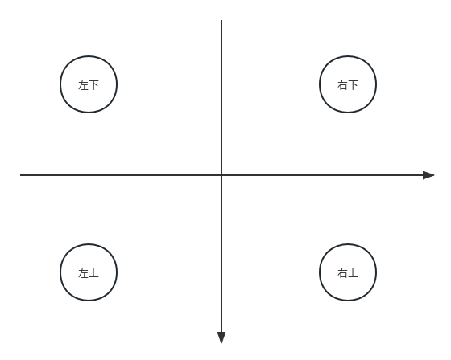

# energy-detector
给辽科的铁子的能量机关分享

nanodet-plus进行待打击叶片的识别，提取roi进行传统识别寻找pnp所需的特征点为上下两个等条的内侧角点

## 环境安装

[安装OpenVino](./doc/openvino.md)

[安装迈德威视SDK](./doc/Mvsdk.md)

## 训练模型

[如何用Nanodet-Plus训练模型](./doc/nanodet_plus.md)

## 关于PNP的方位示意图

